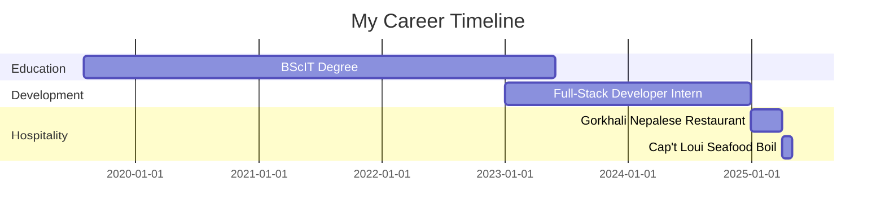

# 💖 Hey there, I'm Susmita Yogi! 

<div align="center">
  
  <br>
  
  
  
  <br>
  <i>✨ Blending software & service into sweet solutions ✨</i>
  <br><br>
  
</div>

##  About Me 


A tech-loving, hospitality-driven creative soul from Queens, NY. I'm passionate about building beautiful software, handling customers with care, and learning something new every day. 📚✨

 **A little more about me...**  

```javascript
const susmita = {
    currentRole: "Cashier/Waitress at Cap't Loui Seafood Boil 🦞",
    location: "Queens, NY, USA 🗽",
    education: "BScIT Graduate 🎓",
    learningNow: "Advanced React, Cloud Computing ☁️",
    lookingToCollaborate: "Web Apps, Database Systems 🤝",
    askMeAbout: ["Django", "MongoDB", "Hospitality", "UI/UX"],
    contactMe: "yogisusmita99@gmail.com 📧",
    funFact: "I can make the perfect cappuccino while debugging code! ☕"
};
```

 <em><b>I love connecting with different people</b> so if you want to say <b>hi, I'll be happy to meet you more!</b> 😊</em>

##  My Skills


<p align="center">
  
  
  
  
  
  
  
</p>

### 💻 Programming Languages
```text
Python       ███████████████████░░░░   85%
JavaScript   ███████████████░░░░░░░░   70%
Java         ████████████████░░░░░░░   75% 
C++          ████████████████░░░░░░░   80%
PHP          ████████████████░░░░░░░   80%
```

### ⚙️ Frameworks & Libraries
```text
Django       ██████████████████████░   90%
Next.js      ███████████████░░░░░░░░   70%
Node.js      ████████████████░░░░░░░   75%
Tailwind CSS ████████████░░░░░░░░░░░   65%
Bootstrap    ████████████████░░░░░░░   75%
```

### 🛠️ Tools & Platforms
```text
GitHub       ██████████████████████░   90%
Git          ██████████████████████░   90%
MongoDB      ████████████████░░░░░░░   75%
MySQL        ███████████████░░░░░░░░   70%
Firebase     ████████████████░░░░░░░   75%
Figma        █████████████████████░░   85%
VS Code      █████████████████████████ 99%
```


##  Experience

<div align="center">
  
</div>



**Cashier / Waitress** 👩‍🍳  
*Cap't Loui Seafood Boil – Queens, NY*  
Apr 1, 2025 – Present  
Handling order taking, serving, opening/closing, and prep work in a fast-paced seafood restaurant.

**Waitress / Cashier** 🍽️  
*Gorkhali Nepalese Restaurant – New York*  
Dec 29, 2024 – Apr 1, 2025  
Took customer orders, served food, and managed the cash register, providing excellent customer service.

**Full-Stack Developer Intern** 💻  
*Freelance / Remote*  
2023 – 2024  
Developed Blood Bank Management System using Django and MongoDB as a solo project for final year.


##  Featured Projects

<div align="center">
  <a href="#"></a>
</div>

<div align="center">
  <table>
    <tr>
      <td width="50%">
        <h3 align="center">Blood Bank Management System</h3>
        <p align="center">
          <a href="#" target="_blank">
            
          </a>
          <p align="center">
            A system to manage blood stocks and emergencies across Nepal.
            <br><br>
            <a href="#"></a>
            <a href="#"></a>
            <a href="#"></a>
          </p>
        </p>
      </td>
      <td width="50%">
        <h3 align="center">Hotel Management System</h3>
        <p align="center">
          <a href="#" target="_blank">
            
          </a>
          <p align="center">
            A system to handle booking, rooms, and customer management.
            <br><br>
            <a href="#"></a>
            <a href="#"></a>
            <a href="#"></a>
          </p>
        </p>
      </td>
    </tr>
  </table>
</div>


##  GitHub Stats

<div align="center">
  
</div>

<div align="center">
  
  
</div>

<div align="center">
  
</div>

<div align="center">
  
</div>


<div align="center">
  
  <p>Thanks for visiting! 😊</p>
</div>

##  Let's Connect

<div align="center">
  
  <br>
  
</div>

<div align="center">
  <a href="mailto:yogisusmita99@gmail.com">
    
  </a>&nbsp;&nbsp;
  <a href="https://www.linkedin.com/in/susmita-yogi/">
    
  </a>&nbsp;&nbsp;
  <a href="https://twitter.com/susmitayogi">
    
  </a>&nbsp;&nbsp;
  <a href="https://www.instagram.com/susmitayogi/">
    
  </a>
</div>

<div align="center">
  
</div>


<div align="center">
  
  <br>
  <i>© 2025 Susmita Yogi. All rights reserved.</i>
</div>
